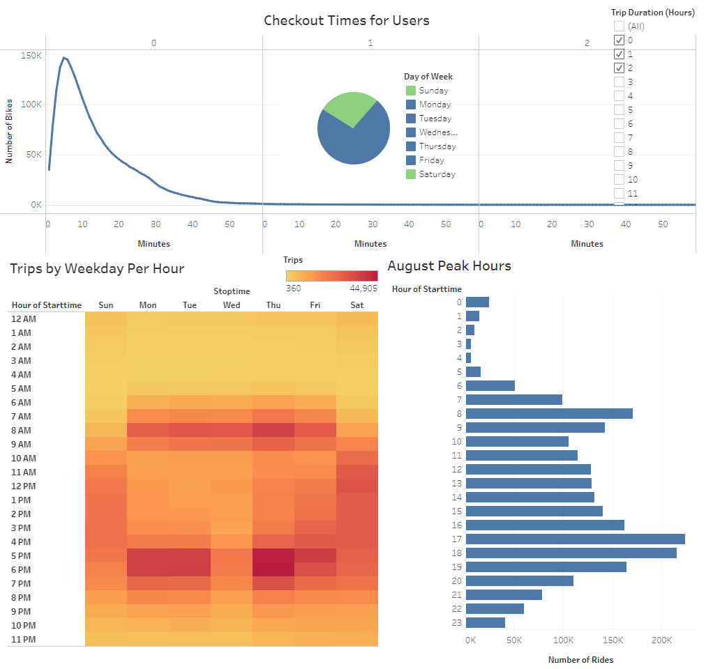
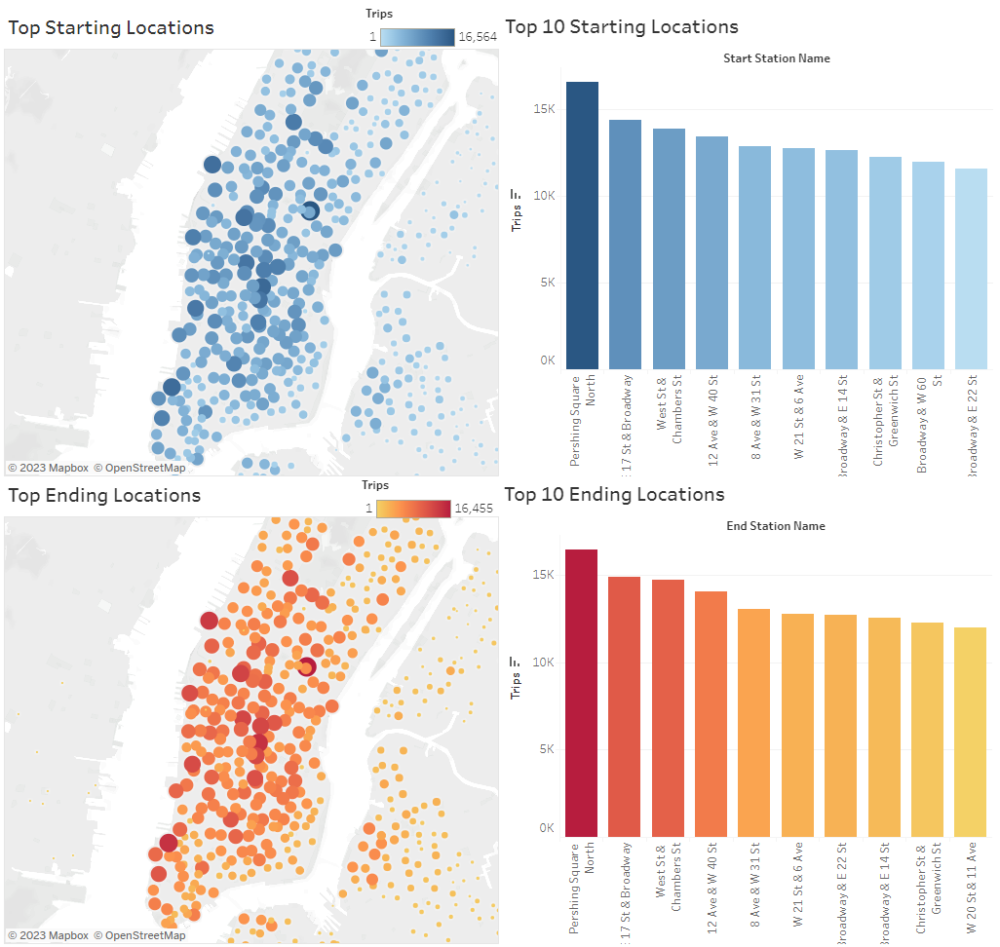

# Citibike Bike-Sharing Program with Tableau

## Overview of Bike-Sharing
In this module, Kate has an idea to bring a bike sharing program similar to Citibike to her hometown of Des Moines, Iowa. She has a potential angel investor who might be willing to provide seed funding. She wants to analyze NYC's bike sharing data to see if something similar would be feasible in Des Moines.

In this challenge, we use Tableau create several plots and visualizations of the Citibike data to glean some insights about how the business operates. From there, we can decide whether or not a similar program in Des Moines would be successful. The deliverables for the challenge are: 

- **Deliverable 1: Change Trip Duration to a Datetime Format**.
    - This change in data was accomplished using the following Python script: [NYC_CitiBike_Challenge.ipynb](NYC_CitiBike_Challenge.ipynb)
- **Deliverable 2: Create Visualizations for the Trip Analysis**.
    - Line graph displaying the number of bikes checked out by duration for all users
    - Line graph displaying the number of bikes that are checked out by duration for each gender by the hour
    - Heatmap showing the number of bike trips for each hour of each day of the week
    - Heatmap showing the number of bike trips by gender for each hour of each day of the week
    - Heatmap showing the number of bike trips for each type of user and gender for each day of the week
- **Deliverable 3: Create a Story and Report for the Final Presentation**.
    - The final Tableau Story can be found here: [Citibike Tableau Story](https://public.tableau.com/app/profile/sean.wood1392/viz/BootcampModule15ChallengeCitibike/citibike?publish=yes)
    - A downloadable version of the Tableau file can be found here: [Citibike_Challenge.twbx](Citibike_Challenge.twbx)   

## Resources
- Citibike September 2019 data: [201908-citibike-tripdata.csv](https://s3.amazonaws.com/tripdata/201908-citibike-tripdata.csv.zip)
- Language(s): Python
- Application(s): Tableau

## Results
In the Tableau story, there are the 5 visualizations created in the Challenge, 7 visualizations created during the module lessons, and 8 new visualizations created by me.

Of Citibike's 2.3 million riders in August of 2019, 81% were subscribers and 19% were one-time customers. Additionally, 65% were men, 25% were women, and 10% did not specify a gender.

On weekdays, commute hours (7-9am and 5-7pm) were most common. On weekends, midday hours were more common. Most trips were 30 minutes or less, most commonly 5 minutes. Weekday commute trips make up 75% of usage. Thursdays are the most popular commute day and Wednesdays are the least popular.

Men and women exhibit roughly the same riding usage patterns in terms of trip length and travel time.

The data for rider age had an outlier in the year 1969. Splitting the ages by gender and usertype, this aberration comes from users with unknown gender. This is probably a user that does not want their information known, so they choose an unknown gender and a fake (innuendo-y) birth year.

Filtering out the users with unknown genders corrects the age distributions. Millenials (born 1981-1996) are by far the most common riders. One-time use customers are most likely tourists, most commonly riding on weekends. Subscribers are most likely commuters, riding mainly during the weekdays.

The vast majority of bikes are used very little, but a small percentage are used very highly.

A threshold of ride time should be implemented. Above this threshold, bike maintenance should be performed to keep bikes safe to ride. Here the threshold was set at 14 days of total ride time.

Bikes at the outer limits of the service area tend to have the longest trip times. Freshly maintained bikes should be placed at these locations.

The top starting locations and ending locations for rides are roughly the same. The number one spot is at Pershing Square North, just outside of Grand Central Station.

## Summary
The Citibike bike-sharing program in New York City is a success because of NYC's high population density and low urban sprawl index. Both of these metrics make commuting and tourism feasible via bike. How do these metrics compare for Des Moines?

- Population density: 29,302 people/mi² (New York City) **\[1\]** vs. 2,428 people/mi² (Des Moines) **\[2\]**
- Urban sprawl index: 203.4 (New York City) **\[3\]** vs. 104.9 (Des Moines) **\[3\]**
- Median commute distance: 0.4 mi (New York City) **\[4\]** vs. 9.1 mi (Des Moines) **\[5\]**

Des Moines is much less densely populated, much more sprawling, and the median commute is more than 20x higher than in New York City. Commuting to work may not be feasible with these distances. Because of these factors, Des Moines is probably not an ideal location suited to a bike-sharing program.

## Citations
**\[1\]** [New York City Wikipedia Page](https://en.wikipedia.org/wiki/New_York_City)

**\[2\]** [Des Moines Wikipedia Page](https://en.wikipedia.org/wiki/Des_Moines,_Iowa)

**\[3\]** [Measuring Urbal Sprawl and Validating Sprawl Measures](https://gis.cancer.gov/tools/urban-sprawl/sprawl-report-short.pdf)

**\[4\]** [Commutes Across America](https://www.streetlightdata.com/wp-content/uploads/2018/03/Commutes-Across-America_180201.pdf)

**\[5\]** [Commuting in the Metro - Des Moines Area](https://www.streetlightdata.com/wp-content/uploads/2018/03/Commutes-Across-America_180201.pdf)

